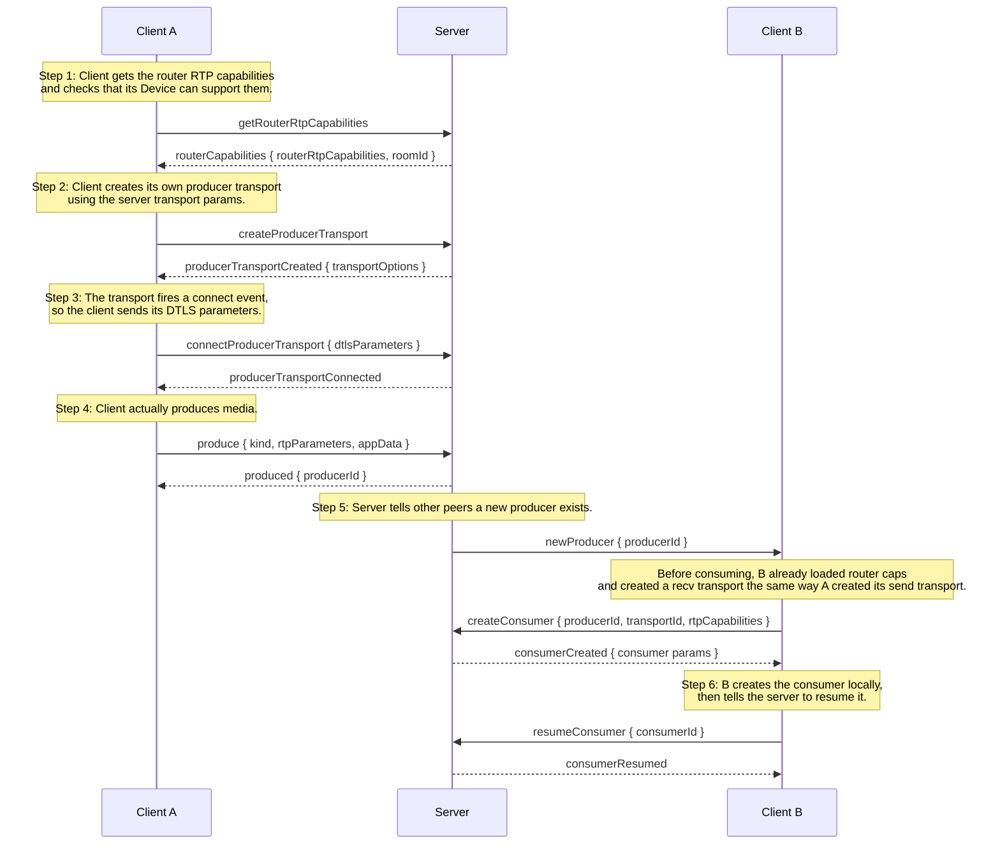

# Roomly

A small group video calling app built around [mediasoup](https://mediasoup.org/) as a WebRTC SFU. It is a personal project I put together to understand how Selective Forwarding Units work under the hood, from signaling to transport creation to producing and consuming tracks.

You can create a room, share the generated room ID, and have multiple people join with camera, microphone, and screen share. Everything runs in the browser.

## What it does

- Create a new room or join an existing one with a UUID.
- Preview your camera and microphone before entering the room.
- Toggle camera and microphone while in the call.
- Share your screen as a separate video tile.
- Copy the room ID from the top bar so others can join.
- Basic reconnection if the WebSocket connection drops.

## Tech stack

- **Client**: React 19, Vite, TypeScript, Tailwind CSS 4, mediasoup-client, Redux Toolkit (only for pre-join mute state), `mitt` for events.
- **Server**: Node.js 20+, Express 5 (only used as an HTTP server), raw `ws`, mediasoup.

## Architecture

The app is split into two parts: a React frontend that handles the UI and local media, and a Node backend that manages mediasoup workers, routers, transports, producers, and consumers.

### Client side

The React app keeps a single WebSocket connection for the whole session. That socket is created lazily, only when the user clicks **Create Room** or **Join Room**.

The main pieces are:

- `client/src/lib/websocket.ts`: singleton WebSocket wrapper with a retry/backoff loop.
- `client/src/lib/handleMessage.ts`: dispatches incoming server messages by type.
- `client/src/lib/mediasoup.ts`: mediasoup-client Device, send/recv transports, request/callback correlation, and remote consumer state.
- `client/src/services/mediaService.ts`: wraps `getUserMedia`, `getDisplayMedia`, local producers, and cleanup.
- `client/src/pages/Home.tsx`: lobby with camera preview, room ID input, create/join buttons, loading overlay, and error banner.
- `client/src/pages/Conference.tsx`: in-call page with the video grid, screen share tiles, controls, and reconnecting overlay.

### Server side

The server boots one mediasoup worker per CPU core and creates one mediasoup router for each room. All state is kept in memory using plain JavaScript Maps.

The main pieces are:

- `server/src/index.ts`: starts the HTTP server, WebSocket server, and mediasoup workers.
- `server/src/lib/ws.ts`: accepts WebSocket connections, assigns each connection a `peerId`, routes incoming messages by type, and cleans up on disconnect.
- `server/src/lib/room.ts`: creates rooms, joins peers, and broadcasts new producers to existing peers.
- `server/src/wsControllers/`: one small handler per message type, such as `onProduce`, `onCreateConsumer`, `onProducerClose`.

Each peer object holds:

- a reference to its WebSocket
- a map of transports
- a map of producers
- a map of consumers

When a peer disconnects, the server closes their transports, removes their producers from the room, broadcasts `producerClosed` to everyone else, and deletes the peer from the room. If the room becomes empty, the router is closed and the room is removed.

### Signaling flow

This is the exact order of messages when a user joins a room:

1. Client opens a WebSocket and sends `createRoom` or `joinRoom { roomId }`.
2. Server replies with `roomCreated` or `roomJoined`.
3. Client sends `getRouterRtpCapabilities`.
4. Server replies with `routerCapabilities { routerRtpCapabilities, roomId }`.
5. Client loads the mediasoup `Device` with those capabilities.
6. Client sends `createProducerTransport` and `createConsumerTransport`.
7. Server replies with `producerTransportCreated` and `consumerTransportCreated`.
8. Client connects both transports and sends `produce` for camera and microphone.
9. Client sends `requestExistingProducers`.
10. Server sends `newProducer` for every producer already in the room.
11. Client sends `createConsumer` for each one, the server replies with `consumerCreated`, and the client resumes the consumer.



Screen sharing follows the same `produce` / `newProducer` / `createConsumer` pattern, but the producer is tagged with `appData: { type: "screen" }` so the UI can show it as a separate tile.

### Media flow

Local media travels like this:

```
getUserMedia()
  -> sendTransport.produce()
     -> server router
        -> remote recvTransport.consume()
           -> MediaStream
              -> <video> element
```

Audio and camera are produced as separate mediasoup producers. The producer `kind` is either `audio` or `video`, so the app uses `appData.type` to distinguish camera video from screen video.

## Project structure

```
.
├── client/                 # React frontend
│   ├── src/
│   │   ├── lib/            # websocket, handleMessage, mediasoup handlers
│   │   ├── services/       # mediaService, signalingEvents
│   │   ├── store/          # Redux store and media slice
│   │   ├── pages/          # Home.tsx, Conference.tsx
│   │   ├── types/          # TypeScript types
│   │   └── utils/          # send helper
│   └── ...config files
└── server/                 # Node backend
    ├── src/
    │   ├── lib/            # ws dispatcher, room logic, worker, transport helper
    │   ├── wsControllers/  # one handler per message type
    │   ├── types/          # TypeScript types
    │   ├── utils/          # send helper
    │   └── config/         # mediasoup config
    └── ...config files
```

## Getting started

You need Node.js 20 or newer. Mediasoup has native dependencies, so you also need a working C++ toolchain on your machine. On Ubuntu/Debian you can install `build-essential` and `python3`. On macOS, Xcode Command Line Tools are enough.

### 1. Configure the server IP

Edit `server/src/config/config.ts` and set `announcedIp` to your local network IP or `127.0.0.1` for localhost testing.

If you are testing on the same machine, `127.0.0.1` is fine. If you want two different devices to talk, use the server's LAN IP.

### 2. Install and run the server

```bash
cd server
npm install
npm run dev
```

The server starts on port `3016` by default.

### 3. Install and run the client

```bash
cd client
npm install
npm run dev
```

The Vite dev server starts on `http://localhost:5173` by default.

### 4. Open the app

Go to `http://localhost:5173`, create a room, copy the room ID, and open the same URL in another tab or browser. Paste the room ID and join.

## Configuration notes

Right now two values are hardcoded:

- `server/src/config/config.ts`: `announcedIp` and the listening port.
- `client/src/lib/websocket.ts`: the WebSocket URL (`ws://localhost:3016`).

If you deploy this, update both to match your server address. There are `.env` files in the repo, but the app does not read them yet.

## Known limitations

This is a learning project, not production software.

- No STUN/TURN server configured by default, so calls across restrictive networks may fail.
- Reconnection works when the server process dies, but there is no heartbeat, so silent network drops take a while to detect.
- State is entirely in memory; restarting the server clears all rooms.
- There is no authentication, origin checking, or rate limiting.
- Server messages are parsed with `JSON.parse` but not validated for shape.
- There are no automated tests.

## Why mediasoup

Most beginner WebRTC tutorials use mesh or simple peer-to-peer. Mesh does not scale past a few users because every peer uploads its video to every other peer. An SFU like mediasoup lets each peer upload once and the server forward the streams, which is the pattern real video apps use. Building it from scratch made the tradeoffs concrete.

## License

This is a personal portfolio project. You can look at the code and learn from it, but it is not licensed for commercial use unless you ask first.
