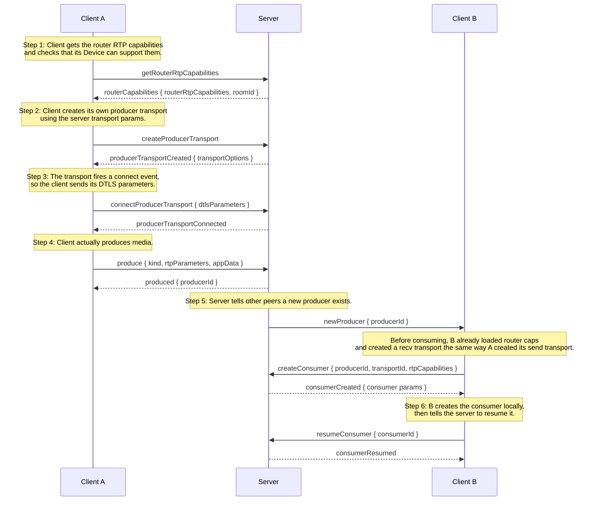

# Signaling flow

This is the actual message flow I use between the React client and the Node server. It is a bit messy because mediasoup splits the work into many small steps, but that is what makes the transport setup explicit.

## What is happening on each side

### Client A (the one producing)

1. Loads the server router RTP capabilities into a mediasoup Device.
2. Creates a send transport.
3. Connects the send transport by sending DTLS parameters.
4. Calls `produce()` for camera and microphone tracks.
5. The server stores the producers and notifies other peers.

### Client B (the one consuming)

1. Does the same router cap check and creates a recv transport.
2. When it receives `newProducer`, it asks to consume that producer.
3. The server creates a consumer on B's recv transport and sends back the params.
4. B calls `recvTransport.consume()` with those params.
5. B resumes the consumer so media starts flowing.

### Server

- Holds one router per room.
- Holds transports, producers, and consumers in Maps per peer.
- Routes messages by type and cleans everything up when a peer disconnects.
